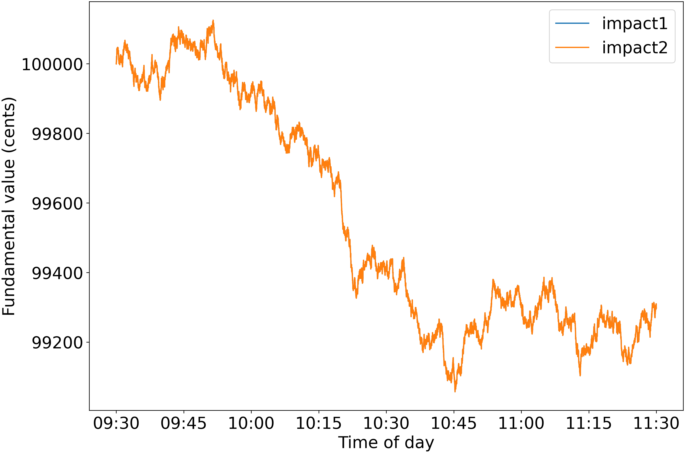
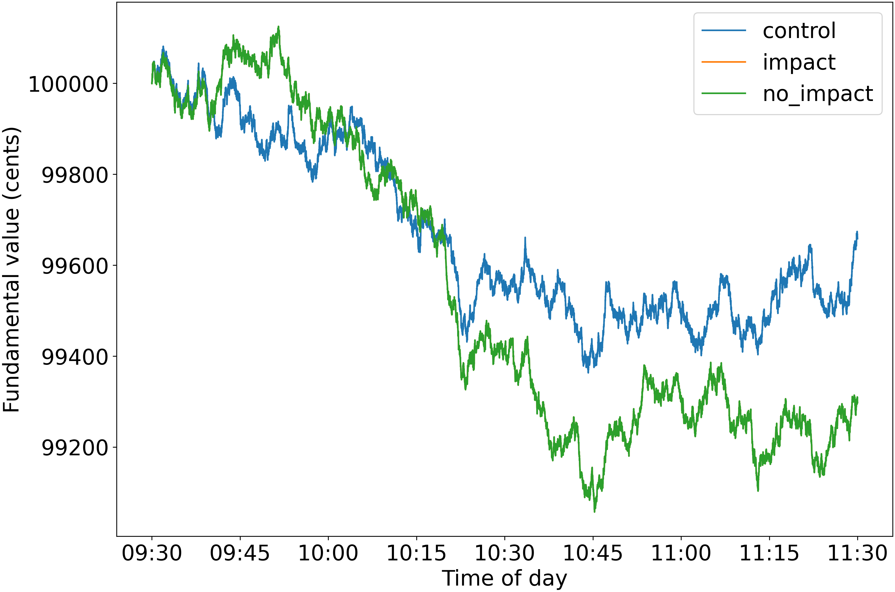
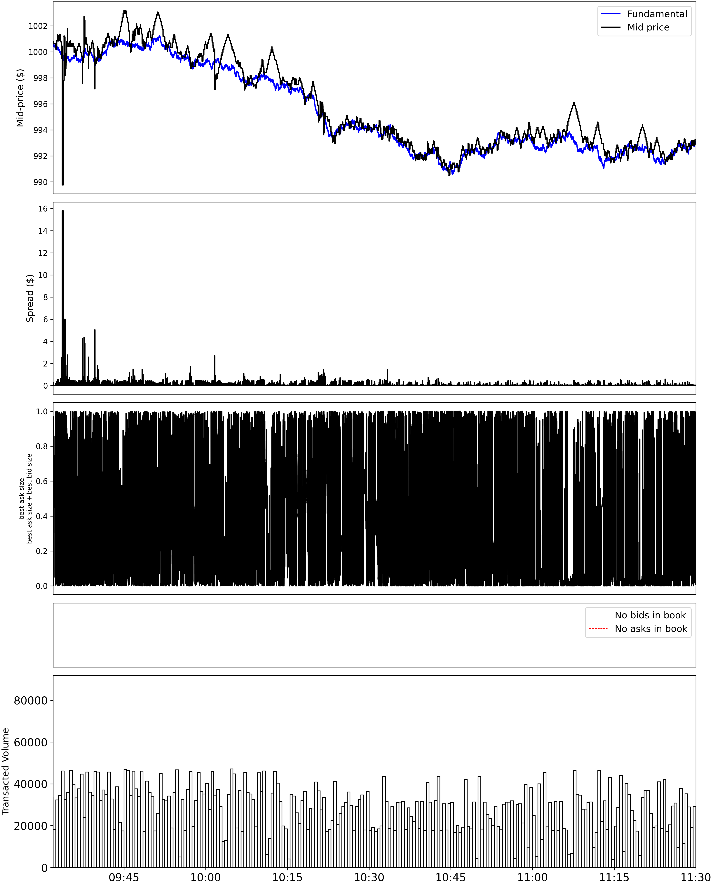
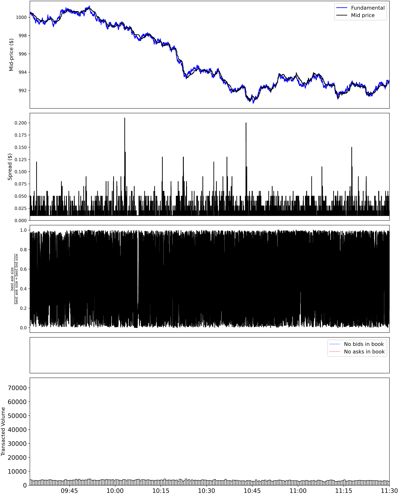
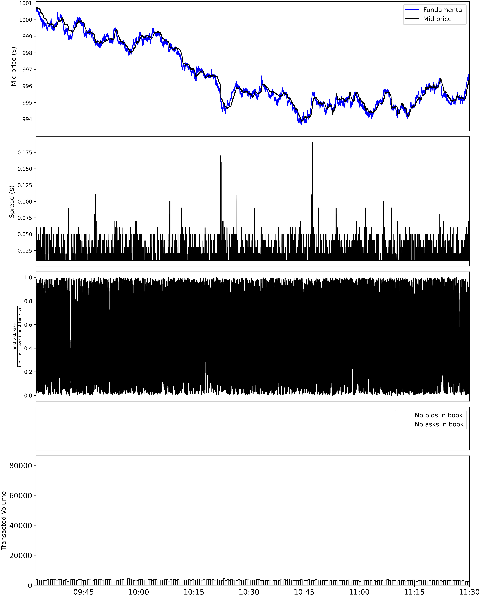

# Evaluate and Detect Attacks in Financial Market with Simulation
This repository contains codes for course project authored by Chenhao Huang, Shlok Khandelwal and Zizhen Lian for 
CMSC498P/798P.

In this project, we study the problem of evaluating and detecting adversarial attacks in financial market by 
using a simulation environment ([ABIDES](https://github.com/abides-sim/abides)).

## Related Works
We start by looking at recent researches about in the adversarial attack on financial market area. We think this area 
is not well studied and has a lot potential. 

### Market Manipulation: An Adversarial Learning Framework for Detection and Evasion
*Xintong Wang and Michael P.Wellman*

This research uses a generative model similar to GAN to get a detector for spoofing attack and a new attack trying to 
evade that detection at each level. The finding of this experiment is that the attack will be able to evade the old 
detection every time, but the effectiveness will get lower and lower; at the end, the attack will not really generate 
benefit. This result raises our interest to find a better attack to study other than regular spoofing.

### Adversarial Attacks on Machine Learning Systems for High-Frequency Trading
*Micah Goldblum, Avi Schwarzschild, Ankit B. Patel and Tom Goldstein*

This research built Multi Layer Perceptron, Linear, and LSTM models as valuation models and their attack was aiming 
to be a small perturbation on the order book. Also, they deployed two kinds of attack: One knowing the weights of 
valuation models and the other without knowing  the  weights. They found that neural networks might be better at 
predicting future price trends


### Spoofing the Limit Order Book: An Agent-Based Model
*Xintong Wang and Michael P.Wellman*

This research studies the effectiveness of spoofing attack in a simulation environment with Zero Intelligence Agent and 
Heuristic Believe Learning Agent. It shows that the spoofing attack they use can affect HBL agents but not ZI agents. 
We are also think simulation is a good to study the problem and are interested in doing our own experiment in a 
simulation environment.

### ABIDES: Towards High-Fidelity Market Simulation for AI Research
*David Byrd, Maria Hybinette and Tucker Hybinette Balch*


## Framework/Pipeline
### Files/Folders
- `config`: folder contains config scripts to use with ABIDES for running experiments with attack agents and 
detection methods.
    + `rmsc03_analysis.py`: experiment based on `abides/config/rmsc03.py`. The experiment runs the config with same 
    paramenters 3 times, each time with a different agent set. **control group** has the same agents as the original 
    config; **impact group** adds attack agents; **no_impact group** adds normal trading agents instead of attack agents.
    + `impact_analysis.py`: attempted experiment based on `abides/config/impact.py`. However, the original config outputs 
    unexpected results, so this experiment doesn't give expected results as well and isn't finished.
- `ABIDES_to_Lobster_data.py`: For the attempt to use the valuation models trained using Avi & Micah's codes, we make 
this data conversion script to convert ABIDES log into the same Dataframe format their codes need. This is not used in 
the final experiment.
- `agents\VulnerableMomentumAgent.py`: Contains trading logic based of Abides momentum agent
- `agents\AttackMomentumAgent.py`: Contains spoofing logic to attack VulnerableMomentumAgent

### Setups
Before running the configs, make sure submodule `abides` is checked out and the environment variable `PYTHONPATH` 
contains the root of the repo `.` and `./abides`.

### Commands

Running the experiments
```bash
# usage
python config/rmsc03_analysis.py -c rmsc03 -t <ticker symbol> -d <historical date> -s <seed> -l <log dir>

# example
python config/rmsc03_analysis.py -c rmsc03 -t ABM -d 20200603 -s 1234 -l rmsc03_two_hour_final
```

Proof of deterministic results
```bash
python abides/util/plotting/chart_fundamental.py -f "log/rmsc03_two_hour_new/impact/fundamental_ABM.bz2" -l impact1 \
-f "log/rmsc03_two_hour_final/impact/fundamental_ABM.bz2" -l impact2
```

Proof of deterministic results
```bash
python abides/util/plotting/chart_fundamental.py -f "log/rmsc03_two_hour_new/impact/fundamental_ABM.bz2" -l impact1 \
-f "log/rmsc03_two_hour_final/impact/fundamental_ABM.bz2" -l impact2
```

Plotting the results
```bash
# control group

python abides/util/plotting/liquidity_telemetry.py "log/rmsc03_two_hour_final/control/EXCHANGE_AGENT.bz2" \
"log/rmsc03_two_hour_final/control/ORDERBOOK_ABM_FULL.bz2" -c abides/util/plotting/configs/plot_09.30_11.30.json
# impact group

python abides/util/plotting/liquidity_telemetry.py "log/rmsc03_two_hour_final/impact/EXCHANGE_AGENT.bz2" \
"log/rmsc03_two_hour_final/impact/ORDERBOOK_ABM_FULL.bz2" -c abides/util/plotting/configs/plot_09.30_11.30.json
# no_impact group

python abides/util/plotting/liquidity_telemetry.py "log/rmsc03_two_hour_final/no_impact/EXCHANGE_AGENT.bz2" \
"log/rmsc03_two_hour_final/no_impact/ORDERBOOK_ABM_FULL.bz2" -c abides/util/plotting/configs/plot_09.30_11.30.json
```

## Agents
### Files/Folders
- `agents`
    + `AttackMomentumAgent.py`: class `AttackMomentumAgent` based of MomentumAgent.py in ABIDES
    + `VulnerableMomentumAgent.py`: class `MomentumAgent` edits MomentumAgent.py in ABIDES
    + `FundamentalTrackingAgent.py`: Copied from ABIDES and fixed some bugs. Not used in the final experiment.
    + `TestVulnerableMomentumAgent.py`: unittests run by using `python TestVulnerableMomentumAgent.py`
    + `TestAttackMomentumAgent.py`: unittests run by using `python TestAttackMomentumAgent.py`
### Vulnerable Momentum Agent

ABIDES already used a momentum agent, however, this agent had a few problems that needed to be addressed. 

#### How it works

The momentum agent that ABIDES implemented calculates the moving average looking back at a window of 20 and 50 days. It then compares the mean price and if the mean price of 20 is greater than the mean price of 50 it will place a buy limit order. If it is the other way around then it will place a sell or sell limit order. Our goal was to incorporate volume into this same trading rule that ABIDES followed, so we calculated the percentage of buy orders to sell orders based on volume. This was done by enabling the Publisher Subscriber communication system within the agent and changing the message body to request up to 10 levels. With this new buy/sell pressure metric we would additionally only trade buy orders if the buy pressure > sell pressure and ask order vice versa while following the same moving average rules from above. 
    
### Attack Agent

The attack agent's goal is to manipulate the market in such a way that it reacts differently, by placing orders on the edge of the orderbook at key moments in the market. 

#### How it works

The attack agent follows a similar design pattern as the agent above, however, the key difference is determining when to place attack orders. Using the same buy/sell pressure metric as above we were able to determine when the buy volume and sell volume were very close to 50%. Doing so enabled us to flood the market with fake orders such that the vulnerable momentum agents would be tricked into thinking the buy pressure is actually a sell pressure or vice versa. This way the attack agents were able to construct orders at critical moments to confuse the new momentum agents.

### Unit Tests

#### BuyPressure

Tests new metric added to incorporate volume into momentum based trading

#### Sell Orders/Buy Orders

Checks limit orders are placed in the right scenario and called with the right parameters depending on the bid, ask, and buy pressure.

## Detection method

### Files/Folders
- `detection`
    + `measure.py`: class `Measure` takes a path to the log dir and two names of the sub-dir and provides two interface 
    functions `load()` and `compare()` for different detection methods to define different log to load and ways of 
    comparing the data.
    + `price_diff.py`: class `PriceMeasure` extends `Measure` and loads the fundamental price, the exchange log and the 
    orderbook log; then construct mid-price using `extract_events_from_stream` in 
    `abides/util/formatting/convert_order_stream.py`, compute the absolute residual for each group and return the ratio.
    + `_diff.py`: class `TradingMeasure` extends `Measure` and loads the fundamental volume, the exchange log and the 
    orderbook log; then construct mid-price using `extract_events_from_stream` in 
    `abides/util/formatting/convert_order_stream.py`, compute the absolute residual for each group and return the ratio.
    + `test_price_diff.py`: unit test for `price_diff.py`。
    + `test_trading_diff.py`: unit test for `trading_diff.py`。
    + `trading_diff.py`: 

### Trading Compare(Bid/Ask)

In order to earn greater profits, traders all want to buy at the Bid price and then sell at the Ask price. As long as we cross-compare the absolute value of the Ask-Bid price of each transaction, we can find the fluctuation of the transaction. So as to discover which transactions are not making money

### Unit Test
#### PriceMeasure
- Test `test_load_successful` loads `impact` and `no_impact` from `log/rmsc03_two_hour_final` and determine if `load()` 
works properly by checking the length of the data. They should all be greater than zero and equal to each other.
- Test `test_self_one` loads `impact` twice and compare the difference. The result should be 1 since it's the same data.

## Results
### Experiment Result
We run the experiment 3 times with control, impact and no_impact group, then compute the ratio between the absolute 
residual of mid-price using fundamental price as baseline. The mid-price is the middle point of the best bid and the 
best ask. Because the control group and no_impact group show that the mid-price follows fundamental price closely, we 
choose to use fundamental price as the baseline instead of fitting a model on the result. We decide not to compare 
impact and no_impact with control group because the difference between control group and the others are too large which 
makes analysing the effect of impact vs. no_impact difficult.

The result of the experiment is a ratio of 1.16 between impact and no_impact, meaning impact has effect on the market 
price compare to no_impage group.

### Proof of deterministic results
The following plot shows that the fundamental price is fixed between two runs of the experiment.



### Fundamental Price Differences
The following plot shows that the fundamental price is different for control group from the other group. That's because 
the fundamental price is randomly generated by `MeanRevertingOracle` at time of requesting, so it will be different if 
the agent behavior is different. Because control group has less agents than the other groups, that's the case.



### Effect on Market
The following plots shows various information of the market for the three groups. Note that the mid-price follows the 
fundamental price closely for no_impact and control, but not impact in the first graph; and that there are much higher 
transaction volume for impact group than for others in the bottom graph.

| impact                                                | no_impact                                                   | control                                                 |
|-------------------------------------------------------|-------------------------------------------------------------|---------------------------------------------------------|
|  |  |  |

## Reference
`abides` submodule refers to [ABIDES](https://github.com/abides-sim/abides).
